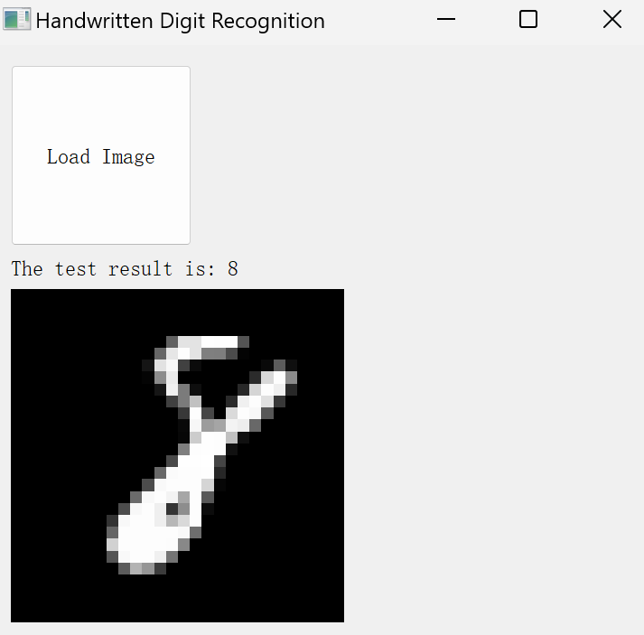

# Digit Recognition with K-Nearest Neighbors (KNN)

## Directory Structure

Below is the project directory structure and the purpose of each folder:



```
Digit_Recognition/
│
├── en/                    # English version files
├── es/                    # Spanish version files
├── handwritten_digits/    # Handwritten digit images
├── ja/                    # Japanese version files
├── ko/                    # Korean version files
├── zh/                    # Chinese version files
└── mnist_784.pth          # Trained model file
```

## Language Support

- **en**: Contains all the code and documentation in English.
- **es**: Contains all the code and documentation in Spanish.
- **ja**: Contains all the code and documentation in Japanese.
- **ko**: Contains all the code and documentation in Korean.
- **zh**: Contains all the code and documentation in Chinese.

## Quick Start

To help beginners get started quickly, each language version folder within the project contains detailed steps and comments. Please select the language version that suits you and follow the steps in the folder for learning and experimentation.

## Contribution

We welcome everyone to submit Pull Requests to improve this project. If you have any questions or suggestions, please feel free to open an Issue.
